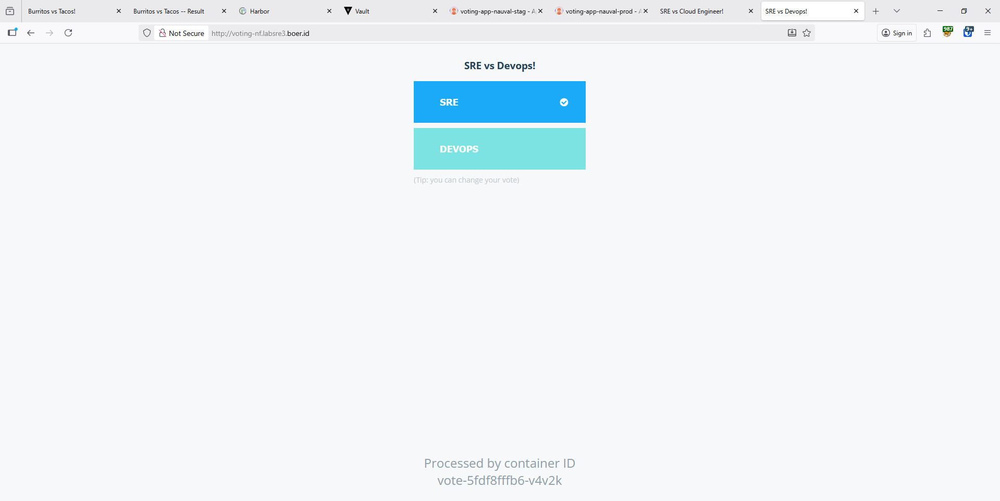
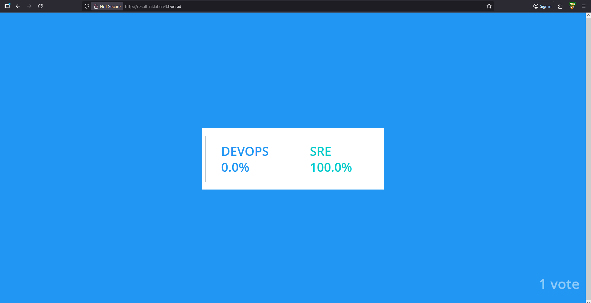

# 🚀 challenge-adinusa

## 📌 Instructions

### 1. Build & Push Images
Build the following applications, then push them to your own registry:

- `vote`
- `worker`
- `result`

📦 **Registry:** `registry.adinusa.id`
---

### 2. Setup Database & Messaging
Deploy the services available in the `tools` folder:

- PostgreSQL  
- Kafka  

#### 🔐 PostgreSQL Secret
Create a Kubernetes secret with the following requirement:

- **Secret name:** `username-database-secret`

> Replace `username` with your Adinusa username.

#### 🔑 Required Variables in Secret

The secret **must contain** the following keys:

- `POSTGRES_USER`
- `POSTGRES_PASSWORD`
- `POSTGRES_HOST`
- `POSTGRES_PORT`
- `POSTGRES_DB`
---

### 3. Vote: Deployment & Service

Create a **Deployment** and **Service** with the following specifications:

- **Port:** `8080`
- **Deployment name:** `username-votes`
- **Service name:** `username-votes-svc`

#### 🖥️ Vote Application Preview

---

### 4. Worker: Deployment

Create a **Deployment** with the following specification:

- **Deployment name:** `username-worker`

#### 🔐 Secret Configuration
If the **worker** application needs database access:

- Use the secret: `username-database-secret`

#### 🖥️ Result Application Preview

---

### 5. Result: Deployment & Service

Create a **Deployment** and **Service** with the following specifications:

- **Port:** `80`
- **Deployment name:** `username-results`
- **Service name:** `username-results-svc`

#### 🔐 Secret Configuration
If the **result** application needs database access:

- Use the secret: `username-database-secret`

---

### 6. Expose Applications Using Ingress

Expose the **vote** and **result** applications using Kubernetes Ingress with the following domains:

- `votes.username.com`
- `results.username.com`

#### 🌐 Ingress Requirements

- Create an **Ingress resource** that routes:
  - `votes.username.com` → `username-votes-svc`
  - `results.username.com` → `username-results-svc`
- Use the appropriate **Ingress Controller** (e.g., NGINX Ingress)
- Configure `/etc/hosts` to point the domains to your Ingress IP for verify web

> Replace `username` with your Adinusa username.

---

## ⚠️ Important Notes

- All `username` prefixes **must be replaced** with your Adinusa username.
- Ensure all images are successfully pushed to Docker Hub before deployment.
- The secret `username-database-secret` can be used by:
  - PostgreSQL (mandatory)
  - Worker (database access is required)
  - Result (database access is required)
- Make sure the service communication flow works correctly:
```
vote → kafka → worker → postgresql → result
```
- 
